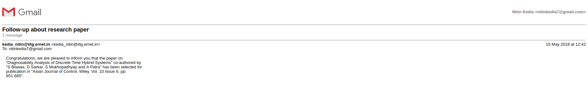
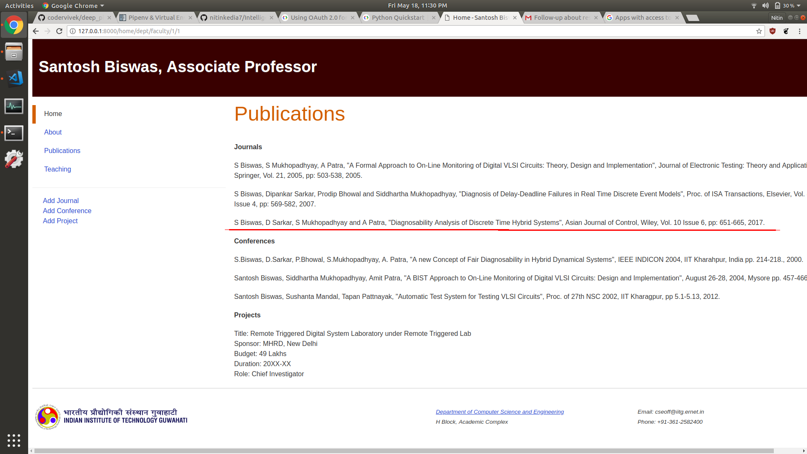

# Intelligent Faculty Portal

Personal homepage generation geared towards faculty at universities using Django Forms. Automatically scans messages in gmail inbox by keyword searching and updates corresponding homepage via the Gmail API.




## Getting Started

### Prerequisites

```sh
Pipenv
A Google Account
```

[Pipenv installation guide](http://docs.python-guide.org/en/latest/dev/virtualenvs/#installing-pipenv)

### Development setup

#### Local Django project

```sh
git clone https://github.com/nitinkedia7/IntelligentFacultyPortal.git
cd IntelligentFacultyPortal/
pipenv sync
python manage.py runserver
```

[Django Documentation](https://docs.djangoproject.com/en/2.0/)

#### Setup Gmail API for your Google Account

Refer Google's awesome documentation:

* [Python Quickstart for Gmail API](https://developers.google.com/gmail/api/quickstart/python)
* [Using OAuth 2.0 for Web Server Applications](https://developers.google.com/api-client-library/python/auth/web-app)

Place the "client_id.json" file in "IntelligentProjectFolder/". Do not rename it "client_secret.json".

## Authors

* **[Nitin Kedia](https://in.linkedin.com/in/nitinkedia7)**
* **[Rohit Pant](https://in.linkedin.com/in/rpant1728)**
* **[Abhinav Mishra](https://www.linkedin.com/in/abmishra1/)**

## Contributing

1. Fork it (<https://github.com/nitinkedia7/IntelligentFacultyPortal/fork>)
2. Create your feature branch (`git checkout -b feature/fooBar`)
3. Commit your changes (`git commit -am 'Add some fooBar'`)
4. Push to the branch (`git push origin feature/fooBar`)
5. Create a new Pull Request